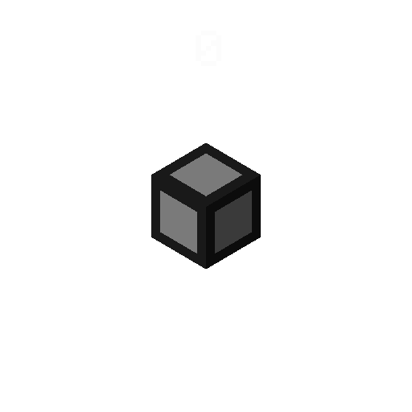

# 🔌 Cables

Cables are custom blocks that handle a cable system between all devices of the same network.

---

## Place/destroy function call

- On place : ``function #itemio:calls/cables/init``
- On destroy : ``function #itemio:calls/cables/destroy``

## Cable update function event

This function tag is trigger when a cable connection is updated.

``function #itemio:event/cable_update``


Cables' itemio.math value is a binary encoded number indicating which sides are connected, ie:

```
    63 -> 1  1  1  1  1  1 -> all sides are active
	  32 16 8  4  2  1
          E  W  S  N  U  D
    This can be used to update the model of the cable.
```

---
## Visual example

::::::{grid} 1 1 2 2
:gutter: 1

:::::{grid-item}
:columns: 4 

::::{grid} 1 1 1 1
:gutter: 2

:::{grid-item-card}



:::

:::{grid-item-card} 
An animation of all possible states of a cable, generated using [Isometric renders fabric mod](https://github.com/glisco03/isometric-renders).


:::

::::

:::::

:::::{grid-item}
:columns: 8


::::{grid} 1 1 1 1
:gutter: 2

:::{grid-item-card} Update function

`````{dropdown} Show

```{code-block} mcfunction
:force:
# @public
execute 
    if entity @s[tag=transportduct.item_cable] 
    run function transportduct:impl/item_cable/update_model:
        scoreboard players set #model transportduct.math 1430300

        scoreboard players operation #model transportduct.math += @s itemio.math
        execute 
            store result entity @s item.tag.CustomModelData int 1 
            run scoreboard players get #model transportduct.math
```
`````

:::

:::{grid-item-card} Model

`````{dropdown} Update function

The modified structure void model. All references are [here](https://github.com/edayot/TransportDuct/tree/master/assets/transportduct/models/block/item_cable)

```{literalinclude} ./cables.json
```
`````
:::

:::{grid-item-card} 
The example [datapack](https://github.com/edayot/TransportDuct/), that implement a simple cable system.
:::

::::

:::::

::::::

