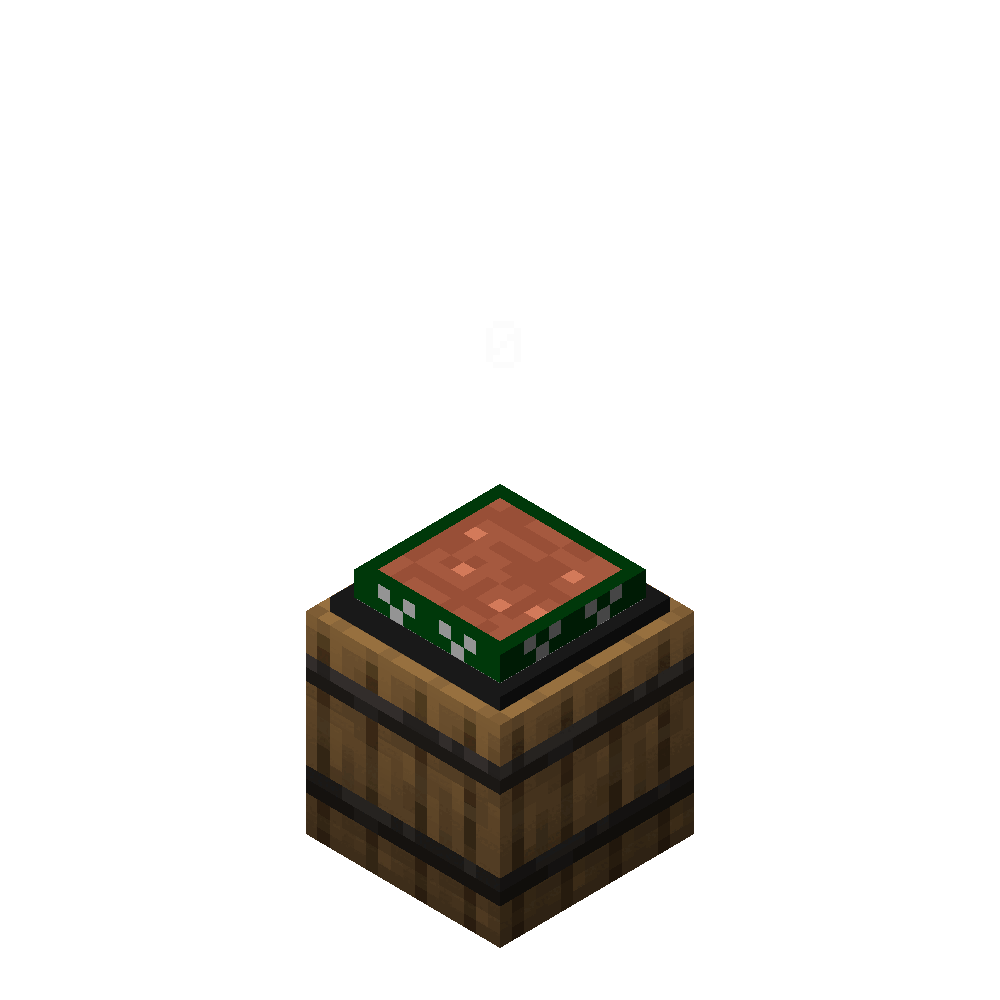

# 🔧 Servos

Servos are custom block parts of a network that can input/output items from/to containers.

## Place/destroy function call

- On place : ``function #itemio:calls/servos/init``
- On destroy : ``function #itemio:calls/servos/destroy``

## Tags


To declare a block as a servos you need to add the tag ``itemio.servo`` to the block. Additionally you can add these tags to the block:

- ``itemio.servo.insert`` : To declare the servo as an insert servo
- ``itemio.servo.extract`` : To declare the servo as an extract servo


## Cable update function event

This function tag is trigger when a servo connection is updated.

``function #itemio:event/network_update``

Servos' itemio.math value is a boolean indicating if the servo is connected to a network or not.

```
1 -> connected
0 -> not connected
```

---
## Visual example

::::::{grid} 1 1 2 2
:gutter: 1

:::::{grid-item}
:columns: 4 

::::{grid} 1 1 1 1
:gutter: 2

:::{grid-item-card}



:::

:::{grid-item-card} 
An animation of all possible states of a cable, generated using [Isometric renders fabric mod](https://github.com/glisco03/isometric-renders). (This example use a different model for insert and extract servo)


:::

::::

:::::

:::::{grid-item}
:columns: 8


::::{grid} 1 1 1 1
:gutter: 2

:::{grid-item-card} 

`````{dropdown} #itemio:event/network_update

```{code-block} mcfunction
:force:
# @public

execute 
    if entity @s[tag=transportduct.servo] 
    run function transportduct:impl/servo/update:     
        scoreboard players set #model transportduct.math 1430117
        scoreboard players operation #model transportduct.math += @s itemio.math
        execute 
            if entity @s[tag=itemio.servo.extract]
            run scoreboard players add #model transportduct.math 2
        execute store result entity @s Item.tag.CustomModelData int 1 run scoreboard players get #model transportduct.math


```
`````

:::

:::{grid-item-card}

`````{dropdown} minecraft:item/furnace.json

The modified structure void model. All references are [here](https://github.com/edayot/TransportDuct/tree/master/assets/transportduct/models/block/servo)

```{literalinclude} ./servos.json
```
`````
:::

:::{grid-item-card} 
The example [datapack](https://github.com/edayot/TransportDuct/), that implement a simple cable system.
:::

::::

:::::

::::::

